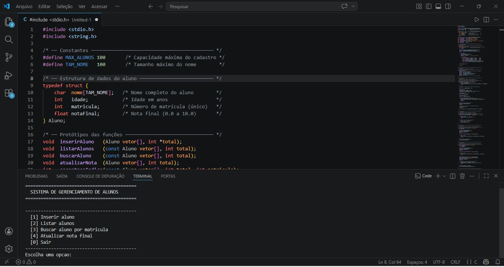

# 🎓 Sistema de Cadastro de Alunos em C

Projeto desenvolvido para a disciplina de **Algoritmos e Programação** da Universidade Unigranrio.

<p align="center">
  
</p>

---

## 📖 Sobre o projeto

Este projeto foi desenvolvido com o objetivo de aplicar conceitos de programação estruturada em C, utilizando structs, vetores, modularização e validação de dados na construção de um sistema de cadastro de alunos.

---

## ✨ Funcionalidades

- Cadastro de alunos
- Listagem de alunos
- Busca por matrícula
- Atualização da nota final
- Validação de matrícula duplicada
- Validação de notas
- Organização modular do código

---

## 🛠 Tecnologias

- Linguagem C
- Struct
- Vetores
- Modularização
- Programação Estruturada

---

## 📂 Estrutura

```
Aluno
├── Nome
├── Idade
├── Matrícula
└── Nota Final
```

---

## 💡 Conceitos aplicados

- Estruturas de dados (`struct`)
- Vetores
- Modularização
- Busca sequencial
- Validação de entrada
- Manipulação de strings
- Organização de código em funções

---

## 📚 Aprendizados

Durante o desenvolvimento deste projeto foram colocados em prática conceitos de lógica de programação, organização de dados, reutilização de código e validação de informações, reforçando os fundamentos da programação em linguagem C.

---

## 👩‍💻 Autora

**Ingrid Rodrigues de Araujo**

Estudante de Análise e Desenvolvimento de Sistemas

